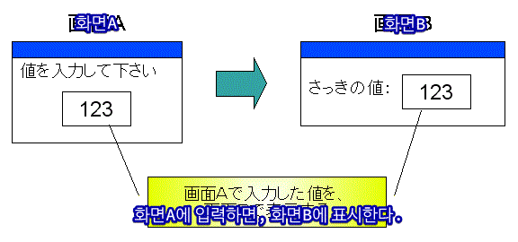
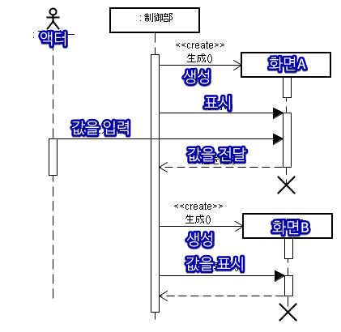
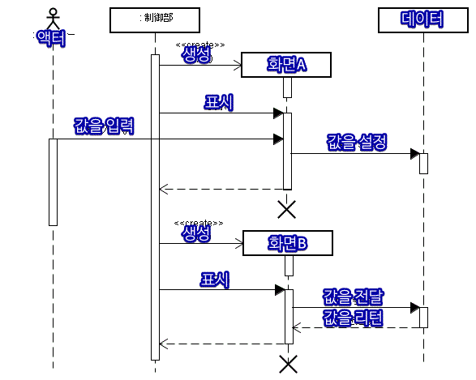
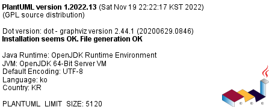
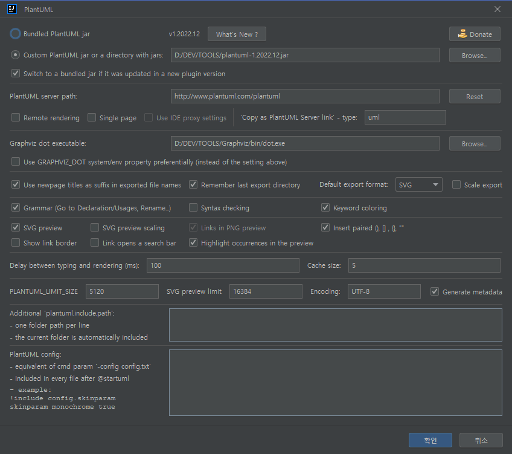

# PlantUML A-Z
-- PlantUML 기본 문법부터 응용까지 --


# 목차

## 개요
* PlantUML Markdown for Sequence Diagram


## 좋은 순서도를 그리기 위한 발상[(日)](http://www.aerith.net/design/sequence-j.html)

[//]: # (    <순서도의 목적>)

[//]: # (    처리되는 흐름을 그림으로 나타내어 소프트웨어 구조를 보기 쉽게 표현하기 위함.)

[//]: # (    예&#41; A에 입력한 값을 B에 표시되는 과정)


### 시퀀스(Scquence) 다이어그램
> 역할이 한정된 객체들이 어떻게 연계하여 1개의 큰 동작을 구현할 것인지 시간의 경과와 함께 나타냄
> <br/> 예) A에 입력한 값을 B에 표시되는 과정

<figure>
    
    <figcaption align = "center">그림1</figcaption>
</figure>

    순서만 나타내기 위한 순서도는 의미가 없음.

<figure>
    
    <figcaption align = "center">그림2</figcaption>
</figure>

    단순히 값을 보여준 순서만 표현한다면 순서도를 쓸 필요까지는 없음.

<figure>
    
    <figcaption align = "center">그림3</figcaption>
</figure>

    단순히 화면에 보여주는 순서를 보여주는 목적이라면 그림3이 간단함.

<figure>
    
    <figcaption align = "center">그림4</figcaption>
</figure>

    화면A에서 입력한 값을 화면B에 표시하는 과정에서의 데이터 흐름까지 표현함.


|객체| 알고 있음                   | 모름                                                 |
|------|-------------------------|----------------------------------------------------|
|화면 A| 입력된 값을 데이터 객체에 설정하는 것까지 | 설정된 값이 실제로 어떻게 사용되는지                               |
|화면 B| 데이터 객체에 설정된 값을 표시하는 것까지 | 값을 설정한 주체                                          |
|제어부| 화면A 다음에 화면 B를 표시하는 것까지| 화면A가 값을 설정하거나 화면B가 값을 표시하는 것|


## 환경
* JetBrains IntelliJ IDEA 2022.2.3 (Ultimate Edition)
* [plantuml-1.2022.14.jar](https://github.com/plantuml/plantuml/releases/tag/v1.2022.13)
  
* [Chrome Extension - MD Reader](https://chrome.google.com/webstore/detail/md-reader/medapdbncneneejhbgcjceippjlfkmkg)
* [Chrome Extension - Markdown Viewer](https://chrome.google.com/webstore/detail/markdown-viewer/ckkdlimhmcjmikdlpkmbgfkaikojcbjk)
* [Chrome Extension - Markdown Preview Plus Dz特别版](https://chrome.google.com/webstore/detail/markdown-preview-plus-dz%E7%89%B9/mbbfdipmmlbkfdkeklpioafmdcodhfli)

## 다이어그램의 시작 선언
### 기본 선언
```
@startuml : UML 시작 선언
@startuml practice.puml : 파일이름 부여
@startuml practice.puml(id=example1) : 다이어그램 아이디 부여
@startuml {파일이름, 설명, width=16cm, plantuml.include.path=파일경로}

@enduml : UML 종료 선언
```

### PlantUML 버전 확인
* 코드
```
version
```
* 결과
* 

1. 로컬 파일 삽입
 ```
!include ../example/Version.puml!EX1
```
```puml
!include ../example/Version.puml!EX1
```
2. 로컬 파일 삽입2
 ```
!include ../example/Version.puml!EX1
```
```puml
!include ../example/Version.puml!EX1
```
3. 아래와 같이 불러오는 것은 불가
```
!include ./example/Version.puml!EX1
!include plantuml-markdown-guide/example/Version.puml!EX1
```

### 공통
#### 주석
#### 확대/축소
#### 제목
#### 캡션
#### 헤더/푸터
#### 콘텐츠 설명
#### 부록
[공식홈페이지](https://plantuml.com/ko/commons)
[다이어그램 예제](https://www.planttext.com/)
[다이어그램 예제2](http://yohshiy.blog.fc2.com/blog-category-22.html)

* 시퀀스다이어그램
```
<style>
title {
  HorizontalAlignment right
  FontSize 24
  FontColor blue
}

header {
  HorizontalAlignment center
  FontSize 26
  FontColor purple
}

footer {
  HorizontalAlignment left
  FontSize 28
  FontColor red
}

legend {
  FontSize 30
  BackGroundColor yellow
  Margin 30
  Padding 50
}

caption {
  FontSize 32
}
</style>
```

#### 캡션


### 컴포넌트
```puml
!include ../example/Component.puml!EX1
```


### 다른 파일의 다이어그램 삽입
```
@startuml {파일이름, 캡션 텍스트, width=16cm, plantuml.include.path=D:/WORK/workspace/my/plantuml-markdown-guide/example/arrow.puml!AAA}
```


## 다이어그램의 헤더 선언하기
* 기본 선언
```
right header ※ 예제: 화살표 역방향
```
```puml
!include ../example/hyperlink/practice.puml!SEQUENCE_DIAGRAM_EX6
```

## 주석 표현하기
```
주석 텍스트 앞에 따옴표(')를 붙이면 주석으로 인식한다.
```
```
note left
  '이것은 한줄 주석입니다.
  주석은 다이어그램에 그려지지 않습니다.
/'
 이것은 여러줄 주석입니다.
 슬래시(/) 문자와 따옴표(') 문자 사이를 함께 사용하면 여러 줄에 걸쳐 주석을 입력할 수 있다.
 그렇다고 합니다.
 '/
 이건 주석이 아닙니다.
end note
```
```puml
!include ../example/comment.puml!EX1
```

## 다이어그램 구조
### 다이어그램 헤더
```
명시적으로 영역을 구분하지는 않지만 선언 위치의 영향을 받는 것 같다.
가능한 각 영역에 맞는 요소를 배치하자. 
```


> 헤더로 들어갈 수 있는 요소들
> * title
```
title 제목을 입력합니다.
```
> * procedure
```
!procedure setTitle($top_label)
    '다이어그램 제목 부여
    title <$top_label>
!endprocedure
```
> * variables
```
<사용자 정의 변수>
선언: !$변수명 = "값"
사용: $변수명

<내장 변수>
사용: <$변수명>

자세한 설명은 다음 세미나 내용에 추가하겠습니다.

!$group_color = "#FFDD22"
!$arrow_color_coral = "#FF9955"
!$group_depth1_color_true = "#E0CAD0"
!$group_depth1_color_false = "#B8CAD0"
!$group_depth2_color_true = "#B7A5AA"
!$group_depth2_color_false = "#97A5AA"

!$top_label = "MobMixer Service Sequence Diagram"
!$client_label = "Clients"
!$server_label = "Servers"
    !$media_label = "Media"
!$ws_label = "WebService"
    !$script_label = "SspScript"
    !$mixer_label = "MobMixer"
    !$sender_label = "SspToDsp"
        !$pass_back_label = "Passback"
        !$pass_back_count_label = "패스백 수"
        !$last_moment_label = "최후의순간"
```


#### 페이지 나누기
```
newpage 페이지 제목을 입력하면 파일로 저장 시 접미어로 이 텍스트가 붙여진다.
newpage 페이지는 여러 번 선언 가능하다.
```
#### 타 사의 확장 요소 불러오기
[다른 파일의 다이어그램 삽입](#다른-파일의-다이어그램-삽입) 을 참조하자.

### 다이어그램 바디
#### 메모
##### 메모 정렬
```puml
!include ../example/Note.puml!EX1
```

```puml
!include ../example/Note.puml!EX2
```

###### 메모 모양
```puml
!include ../example/Note.puml!EX3
```

##### 메모 응용
```
rnote across
'코드 블록
<code>
skinparam sequenceMessageAlign {값}
</code>
'표 그리기
<#FFF,#000>|= 설명 |= 정방향 |= 역방향 |= 좌 |= 우 |
<#FFF>| 선언  | direction | reverseDirection | left | right |
end note
```
```puml
!include ../example/Note.puml!EX4
```

#### 하이퍼링크
#### 개체
#### 연결선
##### 선종류
###### 실선
###### 점선
##### 선 각도
```
A ->(30) B : 30도로 기울어진 연결선
A ->(50) B : 50도로 기울어진 연결선
```

```puml
!include ../example/hyperlink/practice.puml!SEQUENCE_DIAGRAM_EX6
```

###### 수평선
```puml
!include ../example/Line.puml!EX1
```

```puml
!include ../example/Line.puml!EX2
```


###### 수직선
##### 대각선
#### 생명선
#### 색상
#### 스타일 정의

#### 스프라이트
<figure>
    
    <figcaption align = "center"><b>이 스프라이트가 아니다!</b></figcaption>
</figure>

```
[스프라이트 (Sprite)](https://ko.wikipedia.org/wiki/%EC%8A%A4%ED%94%84%EB%9D%BC%EC%9D%B4%ED%8A%B8_(%EC%BB%B4%ED%93%A8%ED%84%B0_%EA%B7%B8%EB%9E%98%ED%94%BD%EC%8A%A4)
컴퓨터 그래픽스
컴퓨터 그래픽스에서 스프라이트는 영상 속에 작은 2차원 비트맵이나 애니메이션을 합성하는 기술이다.
 - 위키백과 -
```

```puml
!inlcude D:/WORK/workspace/my/plantuml-markdown-guide/example/Sprite.puml!EX1
```

#### 변수 정의
```
선언
!$variable_name
사용
$variable_name

```
#### 코드 블록
#### 이미지 삽입
##### 기본
##### 이미지 확대/축소
#### 박스
##### 중첩 박스
#### 그룹 유형
##### 기본 표현
- 기본 표현
```
group 나는그룹
end group
```

##### ALT
- IF/ELSE 표현
```
alt 캐시된 광고가 있으면
    sender <-> topic: 낙찰 수 +1
else 캐시된 광고 없으면
    sender -> sender: blah
end alt
```

##### OPT
- IF 표현
```
opt 캐시된 광고 없으면
  sender -> sender: blah
end opt
```

##### PAR
- 병렬 표현
```
par 작업1
  sender -> sender: blah1
else 작업2
  sender -> sender: blah2
else 작업3
  sender -> sender: blah3
end par
```

##### LOOP
- 반복문 표현
```
loop i=0; dspList.size()>i; i++ 입찰요청
  $sender_label <-> $dsp_label : 입찰 요청()
  getTopic(mixBidDspSspTopic, "입찰 요청 +1")
end loop
```
##### REF
- 레퍼런스 표현(예: 알고리즘)
```
ref over $script_label
    getAdvertisement() {
        List<DSPCookie> = getDspCookies()
        List<MediaDspEntity> = findDspBySspNo()
        MediaGoogleEntity = findMediaGoogleEntity()
        List<DspVo> = getDspMappingList()
    }
end ref
```

##### 지연 표현하기
```
aa -> bb: process1
... 어떤 작업으로 인해 지연이 되는지 기술(생략 가능) ...
aa -> bb: process2
aa -> bb: process3
```

```puml
aa -> bb: process1
... 어떤 작업으로 인해 지연이 되는지 기술(생략 가능) ...
aa -> bb: process2
aa -> bb: process3
```
##### 수평선 그리기
```puml
node aa [
수평선 그릴 대상
]

note left of aa #AEE9FF
1번 메모
----
↑ 실선
-- bb --
↑ 실선에 텍스트
====
↑ 이중 실선
== cc ==
↑ 이중 실선에 텍스트
end note

note right #A7B8F8
2번 메모
end note

note right of aa #5971CA
3번 메모
end note

note right #2E4EC4
4번 메모
end note

note right #0F2A8F
5번 메모
end note

note top of aa #A5FFD1 : 6번 메모

note bottom of aa #6BD19D : 7번 메모
```

##### 프로시저 정의

#### 다이어그램 푸터
### 다이어그램 푸터
#### 캡션
## 하나의 파일에 여러 다이어그램 그리기
### 개별 다이어그램의 ID 부여하기
## 다이어그램의 종료 선언





* PlantUML file (.pu or .puml)
* Text files (.txt),
* HTML files (.html or .htm),
* Java sources files (.java),
* C/C++ source files (.c, .h, .cpp, .hpp or .hh)
* LaTeX sources files (.tex),
* APT files (.apt)
* Word files (.doc)
* URL


## Include
### include 예 1
```puml
!include ../example/practice-include.puml!TAG3
```

### include 예 2
```puml
!include ../example/practice.puml
```


### include 예 3
```puml
!include ../example/practice.puml
bb -> cc : diagramsRoot
```

### include 예 4
```puml
!include ../example/practice.puml
```

### 하이퍼링크 삽입
```
actor aa
rnote over aa: [[https://google.com 링크 텍스트]]
```
xadassda
```puml
skinparam actorStyle Hollow 
:User: --> (Use)
"Main Admin" as Admin
"Use the application" as (Use)
Admin --> (Admin the application)
rectangle {
    actor aaaaa
}
```

### 이미지 삽입
```
actor aa
actor bb

rnote over aa
기본 형태

end note 
rnote over bb
이미지 크기 조절 옵션 추가

end note 
```

```puml
actor aa
actor bb

rnote over aa
기본 형태

end note 
rnote over bb
이미지 크기 조절 옵션 추가

end note 
```

## 사용자 정의 스타일
```puml
!pragma teoz true

skinparam Participant {
    FontSize 10
    BackgroundColor #74C6D7/004452

    FontSize<<topics>> 12
    BackgroundColor<<topics>> #A3E12B/344B08
}

' style enclosure declaration
<style>
    sequenceDiagram {
        .request {
        'participant
            FontSize 12
            BackgroundColor #A3E12B/344B08
        }
        .response {
        'participant
            FontSize 17
            BackgroundColor #12BA3E/B08344
        }
    }
</style>

        box ""Topics"" #FFFFFF
            participant style1 <<request>>
            rnote left style1: request style
            
            participant style2 <<response>>
            rnote left style2: response style
            
            participant style3 <<topics>>
            rnote left style3: topics style
            
            participant style4
            rnote left style4: default style
            
            participant style5 as "sdsads" <<request>>
        endbox


```

#### 참조 링크들
* [dbdiagram](https://dbdiagram.io/home)
* [d2lang](https://d2lang.com/tour/install/)
* [mrhaki blog](https://blog.mrhaki.com/search/label/PlantUML)


```
@startuml(id=STYLE)
* 다이어그램에 아이디를 부여하여 다른 다이어그램 내에 가져와서 사용할 수 있다.
* 사용 예: !include MobMixer_Service_common_style_v0.0.1.plantuml!STYLE
'PlantUML Version 1.2022.12

```
옵션
!pragma teoz true
* Teoz: PlantUML이 지원하는 레이아웃 엔진 중 하나, (Beta)
* 기본 엔진은 Puma 이고, 필요 시 !pragma teoz true 로 선언하여 활성화한 후 사용한다.
* 병렬 표현
* 사용 예: !include MobMixer_Service_common_style_v0.0.1.plantuml!STYLE
  'PlantUML Version 1.2022.12
```

```puml
 !pragma teoz true
'* Teoz: PlantUML이 지원하는 레이아웃 엔진 중 하나, (Beta)
'* 기본 엔진은 Puma 이고, 필요 시 !pragma teoz true 로 선언하여 활성화한 후 사용한다.
'* 병렬 표현
'* 사용 예: !include MobMixer_Service_common_style_v0.0.1.plantuml!STYLE

    box  <$C4person100Small> ""$client_label""
        box <$singlePage>/n""Browsers"" #FFFFFF
            actor "user" as user <<request>>
            participant $media_label as $media_label <<request>>
        endbox
    end box

    box ""InternalService""
        box <$java>/n""Servers"" #FFFFFF
            participant $script_label as $script_label
            participant $sender_label as $sender_label
            participant $cookie_match_label as $cookie_match_label
        endbox
    end box

    box ""ExternalService""
        box #FFFFFF
            collections $dsp_label
        endbox
    end box

```

```
변수 선언
```
<figure>

<figcaption align = "center"><b>Fig.1 - 4K Mountains Wallpaper</b></figcaption>
</figure>


```puml
title <상자로 영역 구분하기>

    box ""$client_label""
        box ""Browsers"" #FFFFFF
            participant $media_label as $media_label <<request>>
        endbox
    end box

    box ""InternalService""
        box ""Servers"" #FFFFFF
            participant $script_label as $script_label
            participant $sender_label as $sender_label
            participant $cookie_match_label as $cookie_match_label
        endbox
        box ""Storage""  #FFFFFF
            participant $ehcache_label as $ehcache_label
            participant $redis_label as $redis_label
            participant $maria_label as $maria_label
        endbox
    end box

    box "MessageQueue(Kafka)"
        box ""Topics"" #FFFFFF
            participant MIX_BID_DSP_SSP_TOPIC as mixBidDspSspTopic <<topics>>
            participant MIX_DSP_SSP_TOPIC as mixDspSspTopic <<topics>>
            participant MIX_SSP_TOPIC as mixSspTopic <<topics>>
            participant EMPTY_TOPIC as emptyTopic <<topics>>
        endbox
    end box

    box ""ExternalService""
        box #FFFFFF
            participant Google
            collections $dsp_label
        endbox
    end box
```

```puml
title <note>

actor as user1
actor as user2

box "박스"
  user1 ->  user2
end box

note left : aaa
note right : aaa
'note across : across
'note left : aaa
'note left : aaa

```

```puml
title <예제>

!include <cloudogu/common>
!include <cloudogu/dogus/jenkins>
!include <cloudogu/dogus/cloudogu>
!include <cloudogu/dogus/scm>
!include <cloudogu/dogus/smeagol>
!include <cloudogu/dogus/nexus>
!include <cloudogu/tools/k8s>

node "Cloudogu Ecosystem" <<$cloudogu>> {
	DOGU_JENKINS(jenkins, Jenkins) #ffffff
	DOGU_SCM(scm, SCM-Manager) #ffffff
	DOGU_SMEAGOL(smeagol, Smeagol) #ffffff
	DOGU_NEXUS(nexus,Nexus) #ffffff
}

TOOL_K8S(k8s, Kubernetes) #ffffff

actor developer

developer --> smeagol : "Edit Slides"
smeagol -> scm : Push
scm -> jenkins : Trigger
jenkins -> nexus : Deploy
jenkins --> k8s : Deploy
```

```puml
title <하이퍼링크>
note left : [[https://google.com 클릭하면 google로 이동합니다.]]
```


```puml
title 그룹 제목(Legend)
legend
    | Color | Flow |
    |<#Red>|  Flow 1 |
    |<#Blue>|  Flow 2 |
endlegend
```


```puml
title <색상 표현>
legend
    | 표현 | 설명 |
    |<#Red> #Red|  색상명 |
    |<#DE0AAF> #DE0AAF|  헥스코드6자 |
    |<#D0A> #D0A|  헥스코드3자 |
endlegend
```

```puml
colors
```
*색상표*

```puml
title
|  | 
|:--:| 
| *Space* |
end title
```

```puml
skinparam responseMessageBelowArrow true

autonumber "<B>[00]"
Bob -> Alice : Authentication Request
Bob <- Alice : Authentication Response
```


```
title < 사용자 정의 스타일 >

'<<---------------- 스타일 ---------------->>
'hide unlinked
!pragma teoz true
'!pragma salt true
'!pragma userVerticalIf on
'skinparam useBetaStyle true
skinparam BackgroundColor #C4F2FF/C400FF
skinparam DefaultFontName 나눔바른고딕

skinparam Sequence {
'Message Style
    ResponseMessageBelowArrow true
'    MessageAlign direction
    MaxMessageSize 150
'Page Styles
    NewpageSeparatorColor #00F
'Stereotype Style
    StereotypeFontColor #ddd
'    StereotypeFontName 굴림
    StereotypeFontSize 12
'    StereotypeFontStyle
'Box Style
    BoxPadding 5
'    BoxBackgroundColor #semi-transparent
'    BoxBorderColor #FFF
'    BoxFontColor
'    BoxFontName
'    BoxFontSize
'    BoxFontStyle

}

skinparam SequenceGroupBodyBackgroundColor semi-transparent

skinparam Legend {
    BackgroundColor #FFF
    BorderColor #EEE
}

skinparam title {
    BorderThickness 2
    BorderRoundCorner 10
    BorderColor semi-transparent
    BackgroundColor #transparent
}
skinparam header {
    BorderThickness 2
    BorderRoundCorner 10
    BorderColor semi-transparent
    BackgroundColor #transparent
}
skinparam LifeLine {
    BorderColor #00F
    BackgroundColor #semi-transparent
}
skinparam Arrow {
    Thickness 1
}
skinparam Actor {
    FontSize 15
    FontColor #000
'    BorderThickness 2
    BorderColor #FFFFFF
    BackgroundColor #74C6D7/004452
    FontSize<<request>> 12
    BackgroundColor<<request>> #A3E12B/344B08
}
skinparam Participant {
    FontSize 15
    FontColor #FFFFFF
    BorderThickness 2
    BorderColor #FFFFFF
    BackgroundColor #74C6D7/004452
    FontSize<<request>> 12
    BackgroundColor<<request>> #A3E12B/344B08

    FontSize<<topics>> 12
    BackgroundColor<<topics>> #A3E12B/344B08
}

skinparam NoteTextAlignment left

' style enclosure declaration
<style>
    sequenceDiagram {
        /'.request {
        'participant
            FontSize 12
            BackgroundColor #A3E12B/344B08
        }'/
        /'.topics {
        'participant
            FontSize 12
            BackgroundColor #A3E12B/344B08
        }'/
    }
</style>

skinparam Collections {
    FontSize 15
    FontColor #FFFFFF
    BorderThickness 2
    BorderColor #FFFFFF
    BackgroundColor #74C6D7/004452
}
skinparam note {
    FontSize 9
    FontStyle bold
}
skinparam SequenceGroup {
    FontColor #000080
    HeaderFontColor #FFF
    HeaderColor #FF1B00
    BorderThickness 2
    BorderColor #434E4E
    BackgroundColor #434E4E
'    BodyBackgroundColor #DFF
    BodyBackgroundColor semi-transparent
}

'<<---------------- 스타일 끝 ---------------->>
```